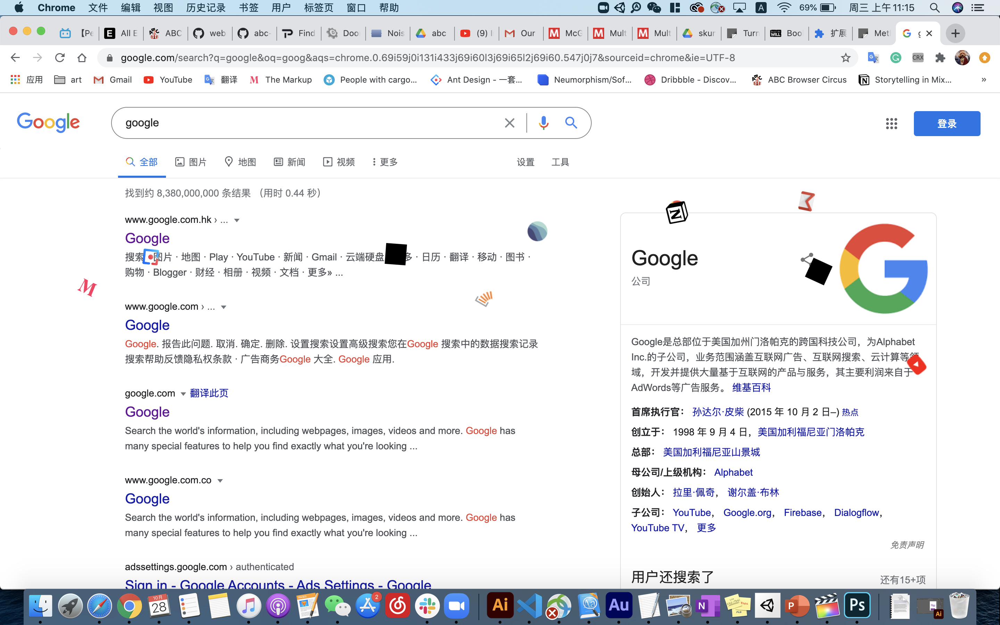
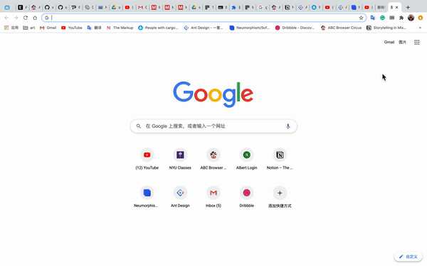

## Don't Open Too Many Tags

This extension is made for those who always open tons of tags in their chrome (like me). With this extension, if you open more than 30 tags in your browser, the last ten tags will be closed. In the same time, you can see the favicons of these twenty pages falling down on your browser. Thus, you can keep your browser clean and tidy. 

