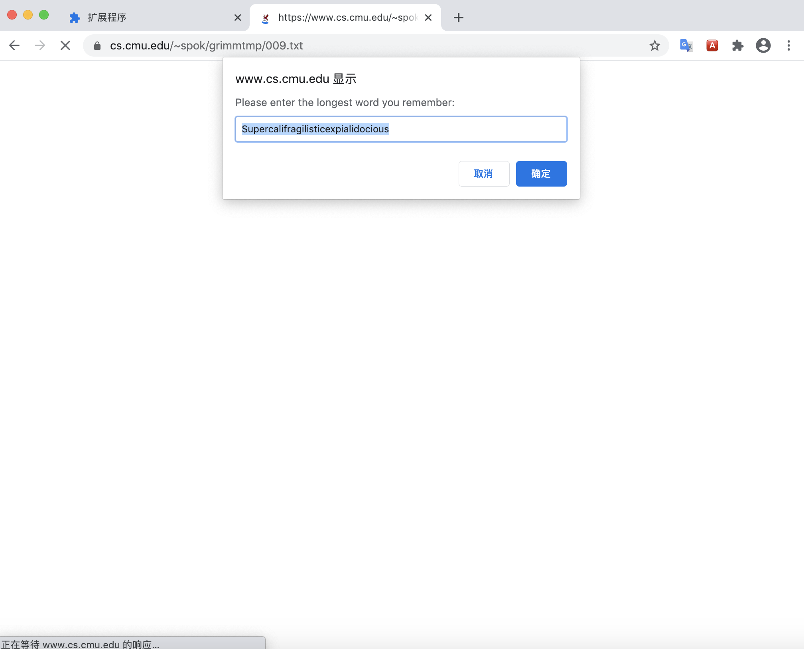
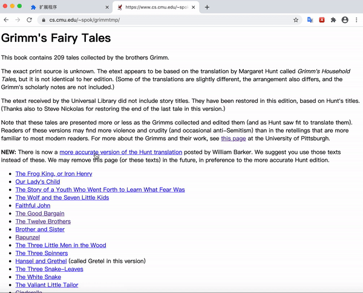
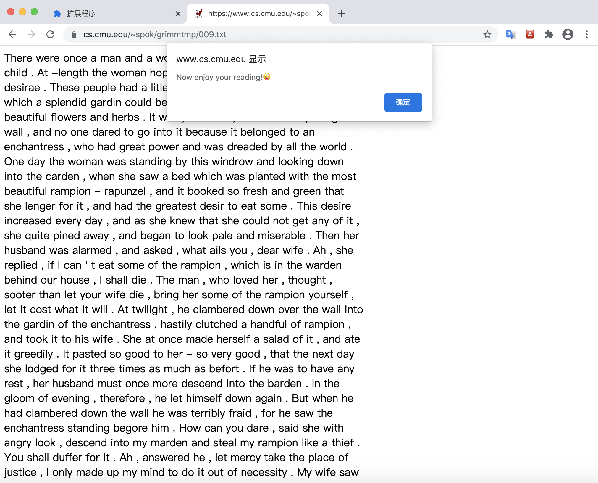
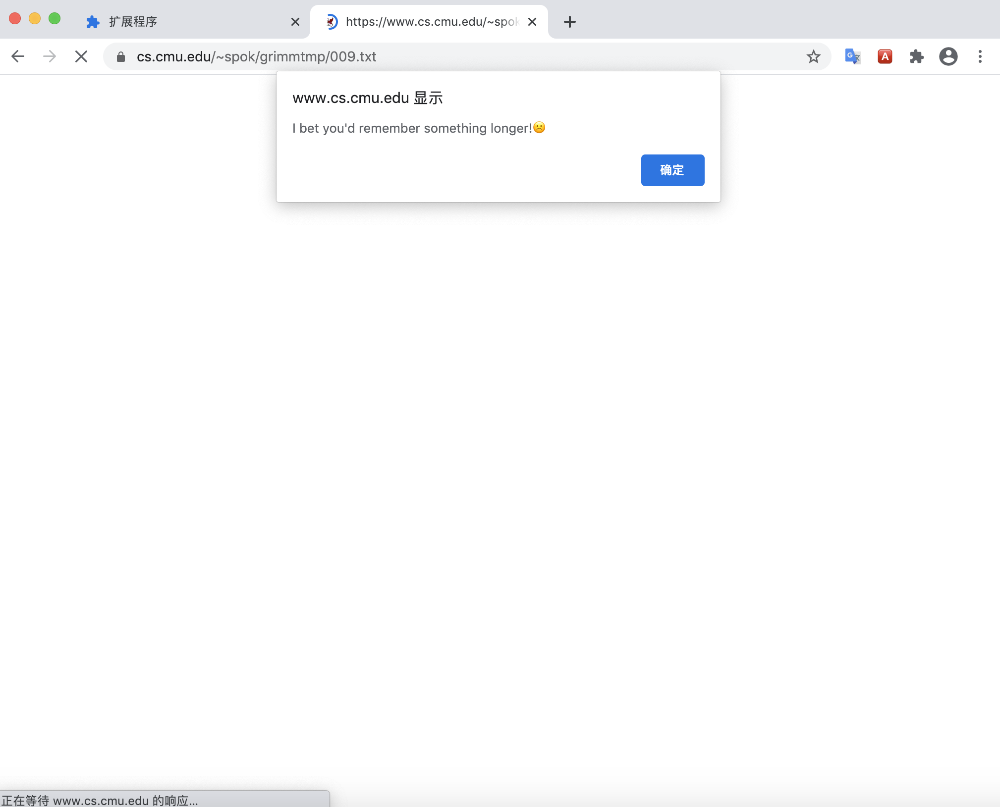

# Project B: Read by Word

## Intro:

Words constitutes sentences; sentences constitutes paragraphs. Sometimes it feels like playing an LEGO game when we look at the way a text is formed.

As an English learner, when we encounter unfamiliar words while reading，we are always told to "guess the meaning of the words from context". It works in most cases, but it also makes us question: What does words means to us readers?
Do you actually understand each word you read? How do we perceive words and to what extent, does words matter to a language?

This extension serves as an experiment on texts, and proposes an challenge to your reading habits on digital platform:

When you insert the extension, you will be asked to type in the longest word you can remember (yes, you can be lost while trying to recall, but that's the point!):

By asking for the longest word you can remember, it plays a trick and changes all the words on the website that has the same length as your input words. Don't worry, it just changes the looking!(For example, google --> goofy).
Now read the new version text you have, does it still make sense? can you still try to "guess the meaning of the words from context"?

The result will fully depends on individual. Maybe you will find it funny, maybe you will find it annoying. By inserting a brake that interferes with the user's reading routines, this extension examines the expression of language and challenges the fast reading habits on a digital platform, where individual elements of the digital content are often overlooked while fast-browsing.

Challenge taken? Now insert
[this extension](https://github.com/Skye-Gao/abc-student-repo/blob/master/projects/project_B/project-b-final.zip?raw=true) to this wesite:https://www.cs.cmu.edu/~spok/grimmtmp/009.txt
and let's see what happens!

## TECHNICAL CHALLENGES
This project has gone through quite a lot technical  challenges, and still has a lot to be improved.

1. Word search API that find similar-looking words

It was not easy to find an API just does exactly what we want: find words that just looks similar. Most API we found served as an dictionary. Luckily, we finally found this words API who can deal with different modifications to words:https://www.datamuse.com/api/ and got the replace words we want.

2. Limitation of the API

We realized the API can only search with  words longer than 4 characters, which made us to rethink on our narrative. We added a sentence to our narrative that when the user input words less than five characters, it will challenge the user to input longer words, so that we can avoid users inputting words with less than four characters.

3. Replace original words with words from the API dataset and have it work on all website.

As we are not directly searching inputed words from API but instead using all the words on the website that have the same length as the inputed word, we first need to collect all those words from the website. We tried to take all the text from the website, split and join, and replace all the innerHTML of the website, but we only get to make it function on pages that only have texts, otherwise it will change the whole layout of the page. This will be the main improvement we want to have to make it work on a random website.

## Some Notes:
This is a concept that plays around with people's reading habits. Being aware that each individual will have very different reading habits, we expect to cause some confusions and misunderstanding with our extension.

Still, while we are continuing to explore this concept, we wish with this extension, people can pay a little more attention to the words they are reading, and think a little more about the meaning words are conveying.
